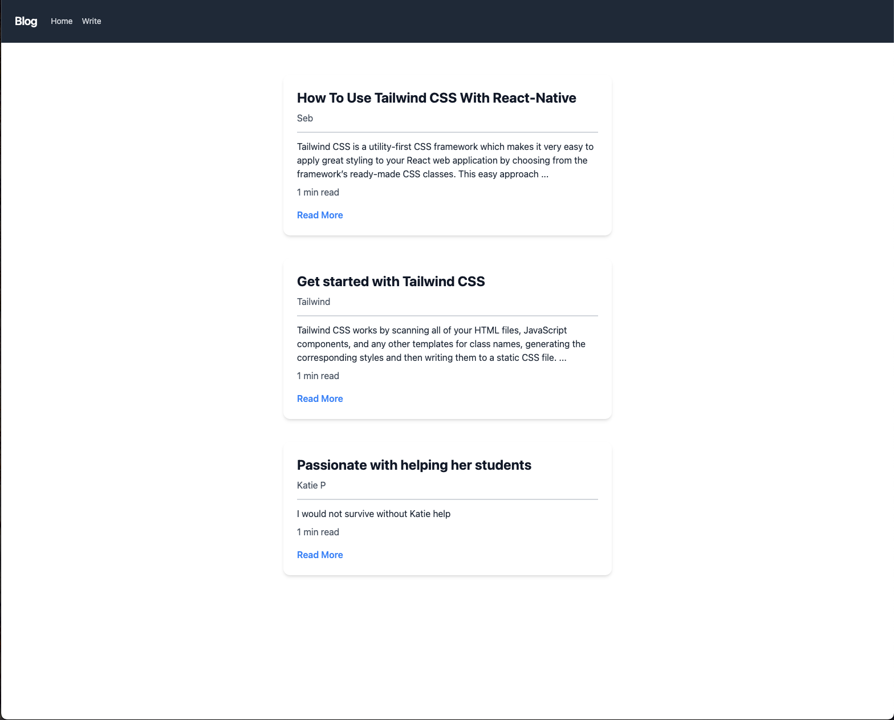
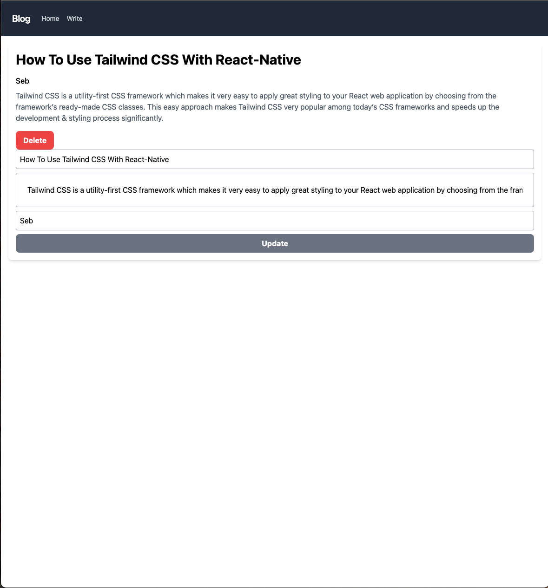

# Capstone Project: Choose a New Technology

# React-with-Tailwind-CSS

A simple React web application that can perform CRUD. The user can create, read, update, and delete. It is styled with Tailwindcss. 

# Planned 

# Current

# Live Link
## Frontend
[Live Link](https://capstoneapp.netlify.app/)

# Frontend Repository

[Backend](https://github.com/ErmiyasHailemichael/React-with-Tailwind-CSS)

# User Stories
[Tello](https://trello.com/b/mmmQjiW2/blog)

# Technology Used
- Django
- Postgres
- React
- Node

